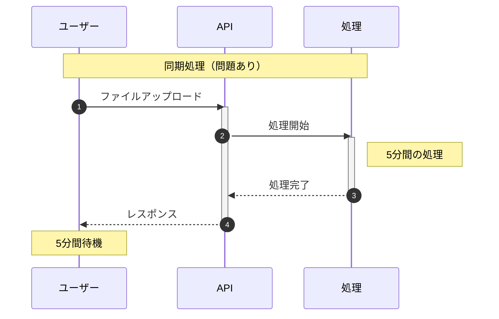
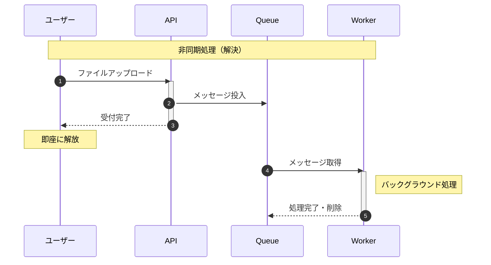
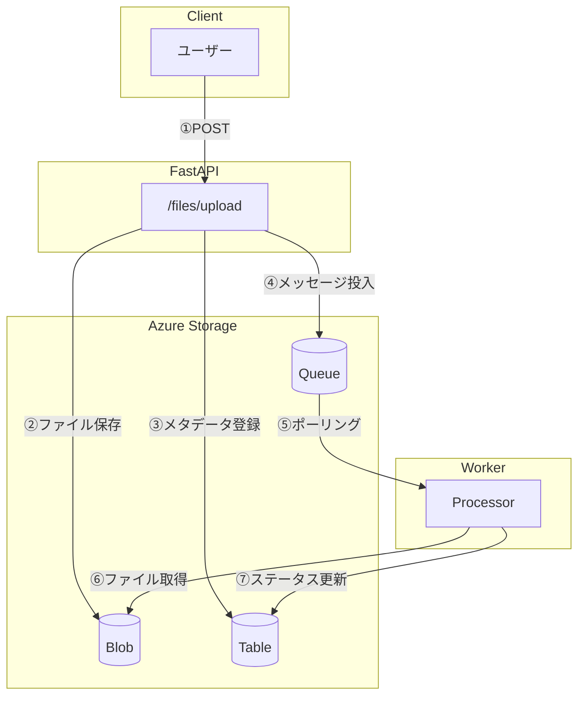

# はじめに

**目的**: 本書の概要と非同期処理システムの設計思想を理解する
**対象**: Python の基本と Docker を扱える初心者〜中級エンジニア

---

## この本について

本書は、**Azure Storage を使った非同期処理システムを構築する方法**を実践を通じて学ぶチュートリアルです。

### サンプルコード

本書のサンプルコードは GitHub で公開しています。

https://github.com/sbk0716/azurite-queue-tutorial

読み終える頃には、以下の 3 つの Azure Storage サービスを連携させた実用的なシステムを手元で動かせるようになります。

| サービス      | 役割                       |
| ------------- | -------------------------- |
| Queue Storage | メッセージによる非同期通信 |
| Blob Storage  | ファイルの永続化           |
| Table Storage | メタデータ・ステータス管理 |

---

## なぜ非同期処理が必要なのか

### 同期処理の問題

以下の図は、同期処理と非同期処理の違いを示しています。同期処理では、ユーザーは処理完了まで待機する必要があります。



### 非同期処理による解決

非同期処理では、時間のかかる処理をバックグラウンドに委譲し、ユーザーには即座にレスポンスを返します。



### 同期 vs 非同期の比較

| 観点             | 同期処理           | 非同期処理             |
| ---------------- | ------------------ | ---------------------- |
| レスポンス速度   | 処理完了まで待機   | 即座に返却             |
| スケーラビリティ | API がボトルネック | Worker を増設可能      |
| 耐障害性         | 失敗時に再実行困難 | リトライ機構を実装可能 |
| 結合度           | API と処理が密結合 | 疎結合で独立開発可能   |

---

## 本書で作るもの

以下の図は、本書で構築するファイル処理システムの全体像を示しています。



### 処理フローの詳細

| ステップ | 処理内容       | 説明                                            |
| -------- | -------------- | ----------------------------------------------- |
| ①        | POST           | ユーザーがファイルをアップロード                |
| ②        | ファイル保存   | Blob Storage にファイル実体を保存               |
| ③        | メタデータ登録 | Table Storage に初期ステータス（pending）を登録 |
| ④        | メッセージ投入 | Queue にファイル処理リクエストを投入            |
| ⑤        | ポーリング     | Worker が Queue からメッセージを取得            |
| ⑥        | ファイル取得   | Worker が Blob からファイルを取得して処理       |
| ⑦        | ステータス更新 | Table Storage のステータスを completed に更新   |

### 3 サービスの役割分担

本システムでは、各 Storage サービスが明確な責務を持ちます。

| サービス | 責務                 | データ例                          |
| -------- | -------------------- | --------------------------------- |
| Blob     | ファイル実体の保存   | アップロードされた画像・文書      |
| Queue    | 処理リクエストの伝達 | `{file_id, processor_type}`       |
| Table    | 状態と属性の管理     | `{status, created_at, file_size}` |

> **設計判断**: なぜ 3 サービスを分離するのか？
>
> 単一サービスですべてを管理することも可能ですが、責務を分離することで以下のメリットがあります：
> - Blob: 大容量ファイルに最適化された保存
> - Queue: 信頼性の高いメッセージ配信（At-Least-Once）
> - Table: 高速なキー検索とステータス更新

---

## 段階的アプローチ

本書は 3 ステップで段階的にシステムを構築します。各ステップで新しい機能を追加し、最終的に完成形に到達します。

### Step 1: Queue のみ（Chapter 1-7）

最もシンプルな形から始め、Queue によるメッセージングの基礎を学びます。

```
API → Queue → Worker → メモリ保存
```

### Step 2: Blob 追加（Chapter 8）

ファイルの永続化を追加し、実用的なファイル処理システムに拡張します。

```
API → Blob → Queue → Worker → Blob 取得
```

### Step 3: Table 追加（Chapter 9-11）

ステータス管理を追加し、処理状態の追跡とエラーハンドリングを実装します。

```
API → Blob + Table → Queue → Worker → Table 更新
```

---

## 本の構成

| Part   | Chapter | 内容                              |
| ------ | ------- | --------------------------------- |
| 基礎編 | 1-4     | 環境構築と Queue Storage の基礎   |
| 実装編 | 5-7     | API・Worker の実装と E2E 動作確認 |
| 拡張編 | 8-9     | Blob・Table Storage の統合        |
| 応用編 | 10-11   | エラーハンドリング・本番移行      |

---

## 前提知識

| 区分 | 内容                                                 |
| ---- | ---------------------------------------------------- |
| 必須 | Python 基本文法（async/await 含む）、Docker 基本操作 |
| 推奨 | FastAPI 経験、REST API 基礎                          |

---

## 関連ドキュメント

### 外部リソース

- [Azure Queue Storage ドキュメント](https://learn.microsoft.com/ja-jp/azure/storage/queues/)
- [Azurite GitHub](https://github.com/Azure/Azurite)
- [FastAPI 公式ドキュメント](https://fastapi.tiangolo.com/)

---

**Next →** Chapter 2: 技術スタック
