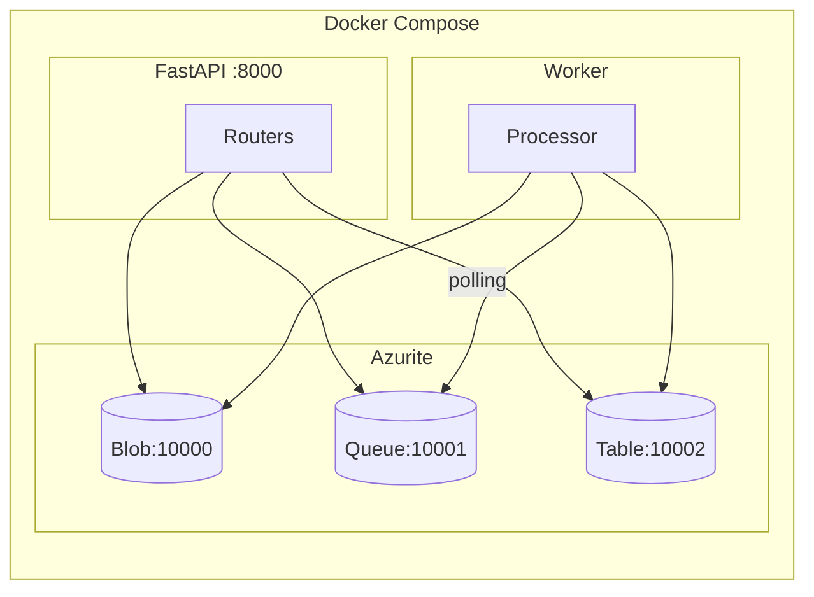
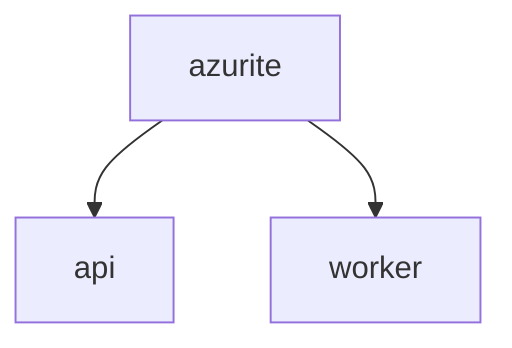

# 技術スタック

**目的**: 本書で使用する技術とその選定理由を理解する
**対象**: 技術選定の背景を知りたい開発者

---

## 全体アーキテクチャ

以下の図は、本書で構築するシステムのコンテナ構成を示しています。



---

## 技術選定の概要

| 技術 | 役割 | 選定理由 |
|------|------|---------|
| Python 3.12 | 言語 | async/await 標準サポート、Azure SDK 充実 |
| FastAPI | Web フレームワーク | 高速、自動ドキュメント、型安全 |
| Azurite | Storage エミュレーター | 本番互換、無料、Docker 対応 |
| Docker Compose | コンテナ管理 | 再現性の高い環境構築 |

---

## Python 3.12

### なぜ Python か

| 候補 | メリット | デメリット |
|------|---------|-----------|
| **Python** | 学習コスト低、SDK 充実、async 標準 | パフォーマンス |
| Node.js | 非同期処理得意、npm エコシステム | 型安全性が弱い |
| Go | 高パフォーマンス、並行処理 | 学習コスト高め |

> **選定理由**: 本書はチュートリアルのため、読みやすさと学習コストを優先して Python を選択しました。本番環境で高スループットが必要な場合は Go も検討してください。

### 使用する主な機能

```python
# async/await: 非同期 I/O の標準サポート
async def process(msg: dict) -> dict:
    return await some_async_operation()
```

---

## FastAPI

### なぜ FastAPI か

| 候補 | 自動ドキュメント | 型バリデーション | 非同期対応 |
|------|-----------------|-----------------|-----------|
| **FastAPI** | Swagger 自動生成 | Pydantic 統合 | ネイティブ |
| Flask | 要追加ライブラリ | 要追加ライブラリ | 要追加設定 |
| Django | DRF で対応 | シリアライザ | 限定的 |

> **選定理由**: 非同期処理との相性、自動ドキュメント生成、Pydantic による型安全を重視して FastAPI を選択しました。

---

## Azurite

### なぜ Azurite か

| 候補 | 互換性 | コスト | セットアップ |
|------|--------|--------|-------------|
| **Azurite** | Azure 完全互換 | 無料 | Docker で即座 |
| 本番 Azure | 本番そのもの | 従量課金 | アカウント必要 |
| LocalStack | AWS 互換 | 無料/有料 | AWS 向け |

> **選定理由**: 本番 Azure との互換性を保ちつつ、ローカルで無料開発できる Azurite を選択しました。

### サービスとポート

| サービス | ポート | 用途 |
|---------|--------|------|
| Blob Storage | 10000 | ファイル保存 |
| Queue Storage | 10001 | メッセージキュー |
| Table Storage | 10002 | メタデータ管理 |

---

## Azure Storage SDK

本書では、各 Storage サービスに対応した公式 SDK を使用します。

| パッケージ | サービス |
|-----------|---------|
| `azure-storage-queue` | Queue Storage |
| `azure-storage-blob` | Blob Storage |
| `azure-data-tables` | Table Storage |

### 基本パターン

すべての SDK は同じパターンで使用します。

```python
# 1. クライアント作成（接続文字列から）
client = ServiceClient.from_connection_string(conn_str)
# 2. リソースクライアント取得
resource_client = client.get_xxx_client(name)
# 3. 操作実行
await resource_client.operation()
```

---

## Docker Compose 構成

### コンテナ構成

| コンテナ | イメージ | 役割 |
|---------|---------|------|
| azurite | mcr.microsoft.com/azure-storage/azurite | Storage エミュレーター |
| api | カスタム（Python 3.12） | REST API サーバー |
| worker | カスタム（Python 3.12） | Queue コンシューマー |

### 依存関係

以下の図は、コンテナ間の起動依存関係を示しています。



> **設計判断**: `depends_on` で Azurite の起動を待ってから API/Worker を起動します。これにより、Storage への接続エラーを防ぎます。

---

## 依存パッケージ

| カテゴリ | パッケージ | 用途 |
|---------|-----------|------|
| Web | fastapi, uvicorn | API サーバー |
| Storage | azure-storage-*, azure-data-tables | Azure 操作 |
| Utility | python-multipart, pyyaml | ファイル処理、設定 |

---

## 関連ドキュメント

### 外部リソース

- [FastAPI 公式ドキュメント](https://fastapi.tiangolo.com/)
- [Azurite GitHub](https://github.com/Azure/Azurite)
- [Azure Storage SDK for Python](https://learn.microsoft.com/ja-jp/azure/storage/blobs/storage-quickstart-blobs-python)

---

**Next →** Chapter 3: 環境構築
