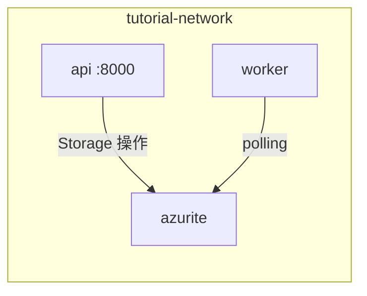

# 環境構築

**目的**: Docker Compose で開発環境を構築し、Azurite との接続を確認する
**対象**: Docker の基本操作ができる開発者

---

## 前提条件

| ツール | バージョン | 確認コマンド |
|--------|-----------|-------------|
| Docker | 20.10+ | `docker --version` |
| Docker Compose | 2.0+ | `docker compose version` |

---

## プロジェクト構成

最終的なプロジェクト構成は以下のようになります。

```
azurite-queue-tutorial/
├── compose.yaml           # コンテナ定義
├── Dockerfile             # Python イメージ
├── Makefile               # 開発コマンド
├── requirements.txt       # 依存パッケージ
├── config/
│   └── queues.yaml        # Worker 設定
├── apps/
│   ├── api/app/           # FastAPI
│   └── worker/app/        # Worker
└── libs/shared/           # 共有ライブラリ
```

---

## Docker Compose 設定

### 設計のポイント

以下の図は、3 つのコンテナの関係を示しています。



### compose.yaml の主要設定

| 項目 | 値 | 理由 |
|------|-----|------|
| `--loose` | Azurite オプション | SDK 互換性向上 |
| `--skipApiVersionCheck` | Azurite オプション | 新しい SDK バージョン対応 |
| `depends_on` | azurite | Storage 起動後に接続 |
| `volumes: .:/app` | マウント | ホットリロード対応 |

> **設計判断**: `--skipApiVersionCheck` を追加することで、Azure SDK の新しい API バージョン（2024-11-04 など）でもエラーなく動作します。

### 完全な compose.yaml

```yaml
# ============================================================
# Docker Compose サービス定義
# ============================================================
# 3つのコンテナで構成:
# - azurite: Azure Storage エミュレータ（Blob/Queue/Table）
# - api: FastAPI アプリケーション
# - worker: キュー処理ワーカー
services:
  # ==========================================================
  # Azurite: Azure Storage エミュレータ
  # ==========================================================
  # ローカル開発用の Azure Storage 互換サービス
  # 本番環境では Azure Storage Account に置き換え
  azurite:
    # Microsoft 公式の Azurite イメージを使用
    # バージョンを固定することで再現性を確保
    image: mcr.microsoft.com/azure-storage/azurite:3.35.0
    # ホストマシンからアクセスするためのポートマッピング
    ports:
      # Blob Storage ポート（ファイル保存用）
      - "10000:10000"
      # Queue Storage ポート（メッセージキュー用）
      - "10001:10001"
      # Table Storage ポート（メタデータ保存用）
      - "10002:10002"
    # Azurite 起動コマンドとオプション
    command: >
      azurite
      --blobHost 0.0.0.0
      --queueHost 0.0.0.0
      --tableHost 0.0.0.0
      --loose
      --disableTelemetry
      --skipApiVersionCheck
    # コマンドオプションの説明:
    # --blobHost/queueHost/tableHost 0.0.0.0: 全インターフェースでリッスン
    # --loose: SDK との互換性を緩和（厳密なチェックを無効化）
    # --disableTelemetry: 匿名利用データの送信を無効化
    # --skipApiVersionCheck: 新しい SDK バージョンでもエラーを回避
    networks:
      # 他のコンテナと同じネットワークに接続
      - tutorial-network

  # ==========================================================
  # API: FastAPI アプリケーション
  # ==========================================================
  # REST API を提供し、ファイルアップロードやタスク作成を受け付ける
  api:
    # カレントディレクトリの Dockerfile からビルド
    build: .
    # ホストマシンからアクセスするためのポートマッピング
    ports:
      # FastAPI のデフォルトポート
      - "8000:8000"
    # ボリュームマウント（開発時のホットリロード用）
    volumes:
      # ホストの現在ディレクトリをコンテナの /app にマウント
      # コード変更が即座に反映される
      - .:/app
    # 環境変数の設定
    environment:
      # Azurite への接続文字列
      # コンテナ間通信なので azurite をホスト名として使用
      - STORAGE_CONNECTION_STRING=DefaultEndpointsProtocol=http;AccountName=devstoreaccount1;AccountKey=Eby8vdM02xNOcqFlqUwJPLlmEtlCDXJ1OUzFT50uSRZ6IFsuFq2UVErCz4I6tq/K1SZFPTOtr/KBHBeksoGMGw==;BlobEndpoint=http://azurite:10000/devstoreaccount1;QueueEndpoint=http://azurite:10001/devstoreaccount1;TableEndpoint=http://azurite:10002/devstoreaccount1;
    # 依存関係: azurite が起動してから api を起動
    depends_on:
      - azurite
    # FastAPI 起動コマンド
    # --reload: ファイル変更時に自動リロード（開発用）
    command: uvicorn apps.api.app.main:app --host 0.0.0.0 --port 8000 --reload
    networks:
      - tutorial-network

  # ==========================================================
  # Worker: キュー処理ワーカー
  # ==========================================================
  # Queue Storage をポーリングしてメッセージを処理する
  worker:
    # API と同じ Dockerfile からビルド
    build: .
    # ボリュームマウント（開発時のホットリロード用）
    volumes:
      - .:/app
    # 環境変数（API と同じ接続文字列）
    environment:
      - STORAGE_CONNECTION_STRING=DefaultEndpointsProtocol=http;AccountName=devstoreaccount1;AccountKey=Eby8vdM02xNOcqFlqUwJPLlmEtlCDXJ1OUzFT50uSRZ6IFsuFq2UVErCz4I6tq/K1SZFPTOtr/KBHBeksoGMGw==;BlobEndpoint=http://azurite:10000/devstoreaccount1;QueueEndpoint=http://azurite:10001/devstoreaccount1;TableEndpoint=http://azurite:10002/devstoreaccount1;
    # 依存関係: azurite が起動してから worker を起動
    depends_on:
      - azurite
    # Worker 起動コマンド
    command: python apps/worker/app/worker.py
    networks:
      - tutorial-network

# ============================================================
# ネットワーク定義
# ============================================================
networks:
  # 全コンテナが参加するブリッジネットワーク
  # これにより azurite, api, worker が互いに通信可能
  tutorial-network:
    # bridge: 同一ホスト上のコンテナ間通信用
    driver: bridge
```

---

## Makefile

開発効率化のためのコマンドを定義します。

| コマンド | 説明 |
|---------|------|
| `make up` | コンテナ起動 |
| `make down` | コンテナ停止 |
| `make logs` | 全ログ表示 |
| `make worker-logs` | Worker ログのみ表示 |

---

## 起動確認

### 1. コンテナ起動

```bash
make up
docker compose ps  # 3 コンテナが Up であること
```

### 2. API 疎通確認

```bash
curl http://localhost:8000/health
# {"status": "healthy", "service": "azurite-queue-tutorial"}
```

---

## Hello World: Queue 操作

Azurite が正しく動作しているか、簡単なメッセージ送受信で確認します。

### 確認スクリプト

```python
# hello_queue.py
from azure.storage.queue.aio import QueueServiceClient

CONNECTION_STRING = "..."  # Azurite 接続文字列

async def main():
    client = QueueServiceClient.from_connection_string(CONNECTION_STRING)
    queue = client.get_queue_client("hello-queue")
    await queue.create_queue()
    await queue.send_message('{"greeting": "Hello!"}')
    # 受信・削除も同様
```

### 期待される出力

```
キュー作成: hello-queue
メッセージ送信: {'greeting': 'Hello, Azurite!'}
メッセージ受信: {'greeting': 'Hello, Azurite!'}
```

---

## トラブルシューティング

### 接続文字列のエンドポイント

| 実行場所 | エンドポイント |
|---------|---------------|
| ホストマシン | `localhost:10001` |
| Docker コンテナ内 | `azurite:10001` |

> **よくあるミス**: ホストで実行するスクリプトから `azurite:10001` に接続しようとすると失敗します。

---

## 関連ドキュメント

### 外部リソース

- [Azurite 公式ドキュメント](https://learn.microsoft.com/ja-jp/azure/storage/common/storage-use-azurite)
- [Docker Compose 仕様](https://docs.docker.com/compose/compose-file/)

---

**Next →** Chapter 4: Queue Storage の基礎
