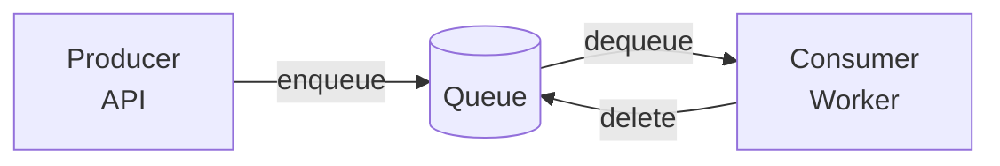
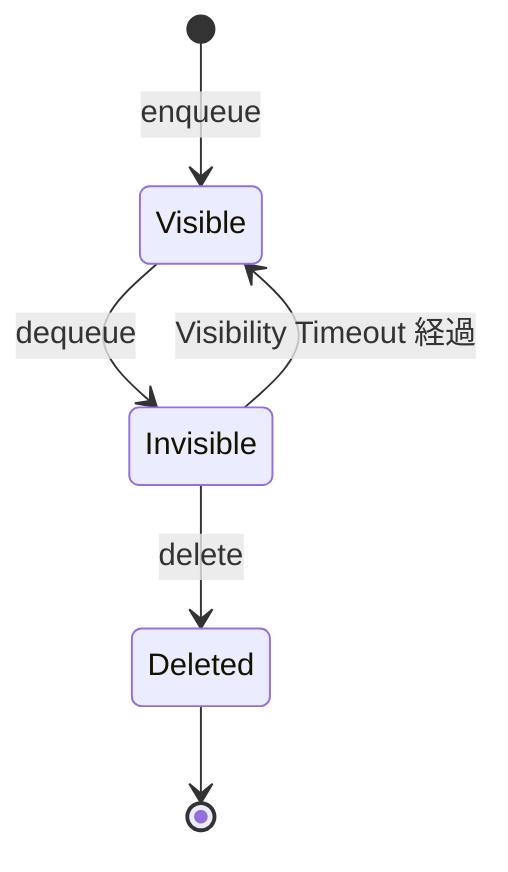
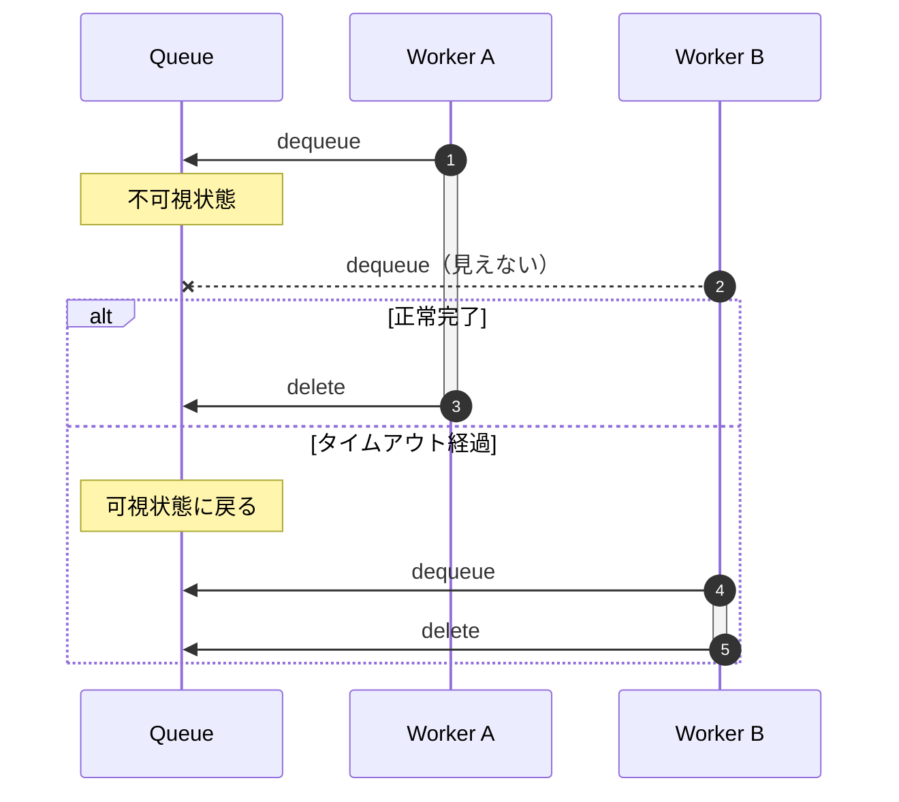

# Queue Storage の基礎

**目的**: Queue Storage の基本概念と At-Least-Once 配信の仕組みを理解する
**対象**: メッセージキューの概念を学びたい開発者

---

## Queue Storage とは

Queue Storage は、Producer と Consumer の間でメッセージを非同期にやり取りするサービスです。

以下の図は、メッセージの基本的な流れを示しています。



### 主な特徴

| 特徴 | 説明 |
|------|------|
| 非同期 | Producer と Consumer が独立して動作 |
| At-Least-Once | メッセージは少なくとも 1 回配信される |
| スケーラブル | 複数 Worker での並列処理が可能 |

---

## メッセージのライフサイクル

以下の図は、メッセージの状態遷移を示しています。



### 状態の説明

| 状態 | 説明 |
|------|------|
| Visible | キューに存在し、dequeue 可能 |
| Invisible | 処理中（他の Consumer から見えない） |
| Deleted | 削除済み |

---

## Visibility Timeout

### なぜ必要か

以下の図は、Visibility Timeout が処理中のメッセージを保護する仕組みを示しています。



### 設定の目安

| 処理時間 | 推奨 Timeout | 理由 |
|---------|-------------|------|
| 数秒 | 30秒 | 短時間処理のデフォルト |
| 数分 | 5-10分 | 処理時間 × 2 + バッファ |

> **設計判断**: 短すぎると処理中に再キューされ二重処理が発生し、長すぎると障害復旧が遅れます。本書では 5 分（300 秒）を標準値として使用します。

---

## Dequeue Count

Dequeue Count は、メッセージが取得された回数です。これにより、繰り返し失敗するメッセージを検出できます。

| dequeue_count | 意味 |
|---------------|------|
| 1 | 初回取得 |
| 2-5 | リトライ中 |
| 5+ | ポイズンメッセージの可能性 |

> **ポイズンメッセージ**: 何度処理しても失敗するメッセージ。Chapter 10 で Dead Letter Queue への移動方法を解説します。

---

## Python での基本操作

### 基本パターン

```python
# Azure SDK: Queue Storage 非同期クライアント
# aio モジュールを使用することで async/await が利用可能
from azure.storage.queue.aio import QueueServiceClient

# 接続文字列からクライアントを生成
# Azurite の場合: "UseDevelopmentStorage=true" または完全な接続文字列
# Azure の場合: Azure Portal から取得した接続文字列
client = QueueServiceClient.from_connection_string(conn_str)

# キュークライアントを取得
# キュー名を指定して特定のキューに対する操作を行う
queue = client.get_queue_client("my-queue")
```

### enqueue / dequeue / delete

```python
# ============================================================
# メッセージ送信（enqueue）
# ============================================================
# JSON 文字列としてメッセージを送信
# Azure Queue Storage は文字列のみを受け付けるため、
# 辞書データは json.dumps() で変換が必要
await queue.send_message('{"task_id": "123"}')

# ============================================================
# メッセージ受信（dequeue）
# ============================================================
# visibility_timeout: 処理中に他の Worker から見えなくなる秒数
# この時間内に処理を完了して delete を呼ぶ必要がある
messages = queue.receive_messages(visibility_timeout=300)

# receive_messages は AsyncIterator を返すため async for で反復
async for msg in messages:
    # メッセージを処理
    # msg.content: メッセージ内容（JSON 文字列）
    # msg.dequeue_count: 取得回数（リトライ判定に使用）
    await process(msg)

    # ============================================================
    # メッセージ削除（delete）
    # ============================================================
    # 処理成功時のみ削除を呼び出す
    # 削除しないと visibility_timeout 後に再キューされる（自動リトライ）
    await queue.delete_message(msg)
```

---

## ベストプラクティス

### 1. メッセージは小さく

| 方式 | 推奨度 | 理由 |
|------|--------|------|
| ID のみ渡す | 推奨 | `{"file_id": "123"}` |
| 大きなデータを含む | 非推奨 | メッセージサイズ上限 64KB |

### 2. べき等性を確保

同じメッセージが複数回処理されても結果が変わらないように設計します。

```python
async def process(order_id: str):
    """
    べき等な処理の実装例

    At-Least-Once 配信では同じメッセージが複数回配信される可能性があるため、
    処理済みかどうかを確認してから実行することで二重処理を防ぐ
    """
    # 処理済みかどうかを確認（データベースやキャッシュで管理）
    if await is_processed(order_id):
        # 既に処理済みの場合は何もせずに終了
        return

    # 実際の処理を実行
    await do_process(order_id)
```

> **なぜべき等性が必要か**: At-Least-Once 配信では、ネットワーク障害等により同じメッセージが複数回配信される可能性があります。

---

## まとめ

| 概念 | 説明 |
|------|------|
| enqueue | メッセージをキューに追加 |
| dequeue | メッセージを取得（不可視に） |
| delete | 処理完了後に削除 |
| Visibility Timeout | 処理中のメッセージを保護 |
| Dequeue Count | リトライ回数の追跡 |

---

## 関連ドキュメント

### 外部リソース

- [Azure Queue Storage の概要](https://learn.microsoft.com/ja-jp/azure/storage/queues/storage-queues-introduction)
- [メッセージング パターン](https://learn.microsoft.com/ja-jp/azure/architecture/patterns/competing-consumers)

---

**Next →** Chapter 5: API から Queue へ投入
