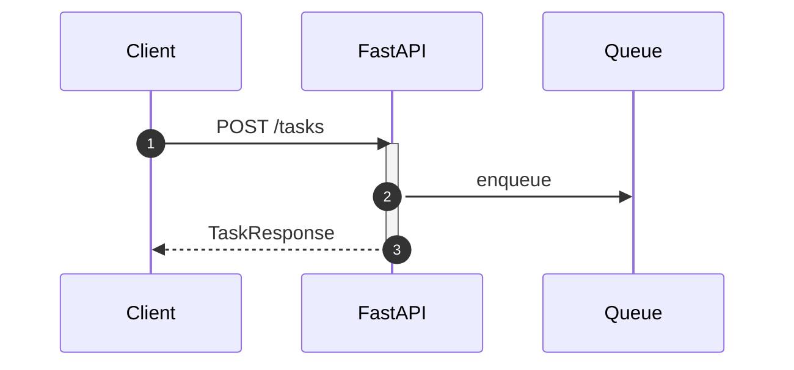

# API から Queue へ投入

**目的**: FastAPI で REST API を作成し、Queue にメッセージを投入する
**対象**: API 実装を学びたい開発者

---

## 全体の流れ

以下の図は、クライアントからのリクエストが Queue に到達するまでの流れを示しています。



---

## アーキテクチャ

### コンポーネント構成

| コンポーネント | ファイル | 役割 |
|--------------|---------|------|
| QueueService | `libs/shared/queue_service.py` | Queue 操作の抽象化 |
| Settings | `libs/shared/config.py` | 設定管理 |
| Tasks Router | `apps/api/app/routers/tasks.py` | タスク API |

### なぜ QueueService を分離するか

| 方式 | メリット | デメリット |
|------|---------|-----------|
| **サービス層分離** | テスト容易、再利用可能 | ファイル増加 |
| Router に直接実装 | シンプル | テスト困難、重複発生 |

> **設計判断**: Queue 操作は Worker でも使用するため、共有ライブラリとして分離します。

---

## QueueService の実装

### 主要メソッド

| メソッド | 役割 |
|---------|------|
| `enqueue` | メッセージを JSON 化してキューに送信 |
| `dequeue` | 指定数のメッセージを取得 |
| `delete_message` | 処理完了したメッセージを削除 |

### コード例

```python
class QueueService:
    """Queue Storage 操作サービス"""

    async def enqueue(
        self,
        queue_name: str,
        message: dict[str, Any],
        ttl: Optional[int] = None,
    ) -> str:
        """
        メッセージをキューに投入

        Args:
            queue_name: キュー名（例: "task-queue"）
            message: 投入するメッセージ（dict）
            ttl: Time To Live（秒）、None の場合は 7 日間

        Returns:
            str: メッセージID
        """
        # クライアントを取得（遅延初期化）
        client = await self._get_client()
        # キュークライアントを取得
        queue_client = client.get_queue_client(queue_name)

        # キューが存在しない場合は自動作成
        try:
            await queue_client.create_queue()
        except Exception:
            # 既に存在する場合は無視
            pass

        # 辞書を JSON 文字列に変換
        # ensure_ascii=False: 日本語などの非 ASCII 文字をそのまま保持
        message_content = json.dumps(message, ensure_ascii=False)

        # メッセージを送信
        result = await queue_client.send_message(message_content)

        # メッセージID を返却
        return result.id
```

詳細は [queue_service.py](https://github.com/sbk0716/azurite-queue-tutorial/blob/main/libs/shared/queue_service.py) を参照してください。

---

## FastAPI エンドポイント

### タスク作成 API

```python
# APIルーターを作成
# - prefix: すべてのエンドポイントに /tasks プレフィックスを付与
# - tags: Swagger UIでのグループ化に使用
router = APIRouter(prefix="/tasks", tags=["Tasks"])


@router.post("", response_model=TaskResponse, status_code=201)
async def create_task(task: TaskCreate) -> TaskResponse:
    """
    タスクを作成し、Queue に投入

    処理フロー:
    1. タスクIDを生成
    2. タスク情報をメモリストアに保存
    3. Queue にメッセージを投入（Worker が後で処理）
    4. タスク情報をレスポンスとして返却
    """
    # タスクIDを生成（UUIDの先頭8文字を使用）
    # 例: "task-a1b2c3d4"
    task_id = f"task-{uuid.uuid4().hex[:8]}"
    # 作成日時をUTCのISO 8601形式で記録
    created_at = datetime.now(timezone.utc).isoformat()

    # タスク情報を辞書として構築
    task_data = {
        "task_id": task_id,
        "name": task.name,
        "description": task.description,
        # 初期ステータスは "pending"（処理待ち）
        "status": "pending",
        "created_at": created_at,
    }

    # Queue にメッセージを投入
    # Worker がこのメッセージを取得して処理を行う
    queue_service = QueueService()
    try:
        # Queue に投入するメッセージを構築
        message = {
            "task_id": task_id,
            "name": task.name,
            "description": task.description,
            # processor_type で Worker がどのプロセッサーを使うか判断
            "processor_type": "task",
        }
        # "task-queue" キューにメッセージを投入
        await queue_service.enqueue("task-queue", message)
    finally:
        # 必ずクライアントをクローズしてリソースを解放
        await queue_service.close()

    # 作成したタスク情報をレスポンスとして返却
    return TaskResponse(**task_data)
```

### リクエスト/レスポンス

| 項目 | 内容 |
|------|------|
| Request | `{"name": "タスク名", "description": "説明"}` |
| Response | `{"task_id": "task-xxx", "status": "pending"}` |

---

## エラーハンドリング

### Queue 投入失敗時の対処

| 方針 | 実装 |
|------|------|
| ロールバック | インメモリストアから削除 |
| エラーレスポンス | 503 Service Unavailable |

```python
try:
    # Queue にメッセージを投入
    await queue_service.enqueue("task-queue", message)
except Exception as e:
    # Queue 投入に失敗した場合はロールバック
    # メモリストアから作成したタスクを削除
    del tasks_store[task_id]
    # 503 Service Unavailable を返却
    # これによりクライアントはリトライを試みることができる
    raise HTTPException(status_code=503, detail="Queue unavailable")
```

> **設計判断**: 本番環境ではデータベーストランザクションとの整合性を考慮した実装が必要です。

---

## 動作確認

### タスク作成

```bash
curl -X POST http://localhost:8000/tasks \
  -H "Content-Type: application/json" \
  -d '{"name": "テストタスク", "description": "説明"}'
```

### 期待されるレスポンス

```json
{
  "task_id": "task-a1b2c3d4",
  "name": "テストタスク",
  "status": "pending",
  "created_at": "2024-01-15T10:30:00+00:00"
}
```

---

## まとめ

| コンポーネント | 役割 |
|--------------|------|
| QueueService | Queue 操作の共通化 |
| Tasks Router | タスク作成 API |
| Settings | 接続文字列等の設定管理 |

---

## 関連ドキュメント

### サンプルコード（GitHub）

- [queue_service.py](https://github.com/sbk0716/azurite-queue-tutorial/blob/main/libs/shared/queue_service.py) - QueueService 実装
- [config.py](https://github.com/sbk0716/azurite-queue-tutorial/blob/main/libs/shared/config.py) - 設定管理

### 外部リソース

- [FastAPI 公式ドキュメント](https://fastapi.tiangolo.com/)
- [Pydantic モデル](https://docs.pydantic.dev/)

---

**Next →** Chapter 6: Worker の実装
