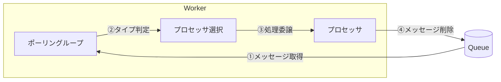
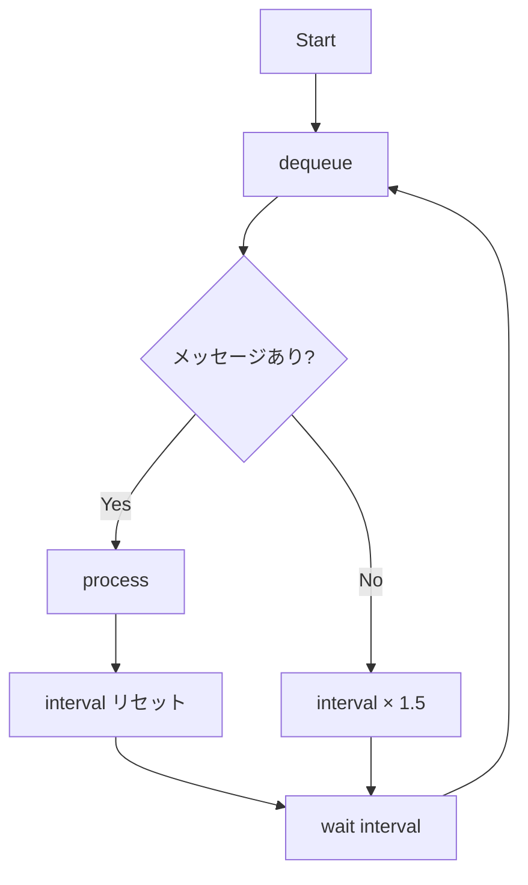
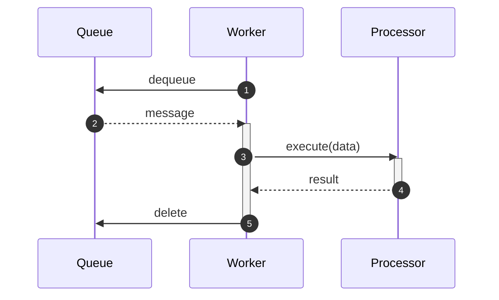

# Worker の実装

**目的**: Queue からメッセージを取得して処理する Worker を実装する
**対象**: ポーリングループとプロセッサーパターンを学びたい開発者

---

## Worker の役割

Worker は Queue Storage を常時監視し、新しいメッセージが投入されると自動的に取得して処理を行うバックグラウンドプロセスです。API がメッセージを投入した後、Worker が非同期で処理を引き継ぐことで、ユーザーは処理完了を待たずに即座にレスポンスを受け取れます。

以下の図は、Worker 内部のコンポーネントがどのように連携してメッセージを処理するかを示しています。



### 処理フローの詳細

| ステップ | 処理内容         | 説明                                                   |
| -------- | ---------------- | ------------------------------------------------------ |
| ①        | メッセージ取得   | Queue から未処理のメッセージを取得（dequeue）          |
| ②        | タイプ判定       | メッセージの `processor_type` を見て処理方法を決定     |
| ③        | 処理委譲         | 適切なプロセッサにメッセージを渡して処理を実行         |
| ④        | メッセージ削除   | 処理完了後、Queue からメッセージを削除して完了を確定   |

---

## アーキテクチャ

### コンポーネント構成

| コンポーネント     | 役割                                           |
| ------------------ | ---------------------------------------------- |
| ポーリングループ   | キューを定期的に監視し、メッセージを取得       |
| プロセッサ選択     | メッセージタイプに応じたプロセッサーを選択     |
| プロセッサ         | 実際のビジネスロジック（タスク処理等）を実行   |

### なぜプロセッサーパターンを使うか

| 方式 | メリット | デメリット |
|------|---------|-----------|
| **プロセッサー分離** | 拡張容易、テスト容易 | 初期実装コスト |
| 単一処理関数 | シンプル | 条件分岐が増大 |

> **設計判断**: 複数の処理タイプ（task, file）に対応するため、Strategy パターンを採用します。

---

## プロセッサー基底クラス

```python
# 標準ライブラリ: 抽象基底クラス定義用モジュール
# ABC: 抽象基底クラスを定義するための親クラス
# abstractmethod: 抽象メソッドを定義するデコレータ
from abc import ABC, abstractmethod


class BaseProcessor(ABC):
    """
    プロセッサー基底クラス

    メッセージ処理の共通インターフェースを定義します。
    新しいプロセッサーを追加する際は、このクラスを継承し、
    execute メソッドと processor_type プロパティを実装してください。
    """

    @property
    @abstractmethod
    def processor_type(self) -> str:
        """
        プロセッサータイプを返す

        Worker がメッセージの processor_type フィールドと照合し、
        適切なプロセッサーを選択するために使用します。
        """
        pass

    @abstractmethod
    async def execute(self, data: dict[str, Any]) -> dict[str, Any]:
        """
        メッセージを処理

        Args:
            data: メッセージデータ（JSON からパースされた辞書）

        Returns:
            dict: 処理結果
                - status: 処理ステータス（"completed" / "failed" など）
        """
        pass
```

### プロセッサーの選択

```python
def get_processor(processor_type: str) -> BaseProcessor:
    """
    プロセッサータイプに応じたプロセッサーを取得

    メッセージ内の processor_type フィールドに基づいて、
    適切なプロセッサーインスタンスを返す。
    """
    # 利用可能なプロセッサーのマッピング
    processors = {
        # タスク処理用（Step 1）
        "task": TaskProcessor(),
        # ファイル処理用（Step 2-3）
        "file": FileProcessor(),
    }
    # 見つからない場合はデフォルトで TaskProcessor を返す
    return processors.get(processor_type, TaskProcessor())
```

---

## ポーリングループ

### 設計のポイント

以下の図は、指数バックオフの仕組みを示しています。



### なぜ指数バックオフか

| 方式 | CPU 使用率 | 応答性 |
|------|-----------|--------|
| 固定間隔 | 高い（空でも同頻度） | 一定 |
| **指数バックオフ** | 低い（空時に自動減速） | 十分 |

> **設計判断**: キューが空の場合はポーリング頻度を下げ、リソースを節約します。Jitter（ランダム遅延）を加えることで、複数 Worker の競合を緩和します。

### コード例

```python
async def queue_poller(queue_config, queue_service: QueueService) -> None:
    """
    キューごとの独立ポーリング

    無限ループでキューをポーリングし、メッセージを処理する。
    メッセージがない場合は指数バックオフで待機時間を延長し、
    Azure Storage へのリクエスト数（コスト）を抑える。
    """
    # 現在のバックオフ間隔（初期値は設定のポーリング間隔）
    current_backoff = queue_config.polling_interval

    # 無限ループでポーリング
    while True:
        # メッセージ取得
        messages = await queue_service.dequeue(
            queue_config.name,
            # 一度に最大10件取得
            max_messages=10,
            # 可視性タイムアウト: 5分（処理中は他のWorkerから見えない）
            visibility_timeout=300,
        )

        if messages:
            # ============================================================
            # メッセージあり → 処理してバックオフリセット
            # ============================================================
            # メッセージがあった場合はバックオフをリセット
            current_backoff = queue_config.polling_interval

            # 各メッセージを処理
            for msg in messages:
                # Semaphore で同時実行数を制御
                async with semaphore:
                    await process_message(
                        queue_service,
                        queue_config.name,
                        msg,
                        queue_config.max_retries,
                        queue_config.dlq_ttl_days,
                    )
        else:
            # ============================================================
            # メッセージなし → 指数バックオフ + Jitter
            # ============================================================
            # Jitter: ランダムな揺らぎを追加（複数Worker間の同期を防ぐ）
            jitter = random.uniform(0, 0.5)
            # 指数バックオフ: 待機時間を1.5倍に増加（上限あり）
            current_backoff = min(
                current_backoff * 1.5 + jitter,
                queue_config.backoff_max,
            )

        # 次のポーリングまで待機
        await asyncio.sleep(current_backoff)
```

---

## 並行数制御

### Semaphore による制限

```python
# 設定ファイルから並行処理数を取得
# config.py の WorkerSettings で定義
MAX_CONCURRENT = settings.worker.max_concurrent  # デフォルト: 5

# Semaphore を生成（同時実行数を制限）
semaphore = asyncio.Semaphore(MAX_CONCURRENT)

async with semaphore:
    # Semaphore 内でメッセージを処理
    # MAX_CONCURRENT を超える並行処理は待機
    await process_message(...)
```

| 設定値 | 影響 |
|--------|------|
| 小さい | リソース消費少、スループット低 |
| 大きい | リソース消費多、スループット高 |

> **設計判断**: 同時処理数を制限することで、メモリやネットワーク接続の枯渇を防ぎます。並行処理数は設定ファイル（`config.py`）で管理することで、デプロイ環境に応じた調整が容易になります。

---

## メッセージ処理フロー

以下の図は、メッセージの処理フローを示しています。



### 処理成功時

1. メッセージを dequeue
2. プロセッサーで処理実行
3. 成功したらメッセージを delete

### 処理失敗時

1. メッセージを dequeue
2. プロセッサーで処理実行
3. 例外発生 → delete しない
4. Visibility Timeout 後に再キュー

---

## 動作確認

### 1. コンテナ起動

```bash
make up
```

### 2. タスク作成

```bash
curl -X POST http://localhost:8000/tasks \
  -H "Content-Type: application/json" \
  -d '{"name": "テストタスク"}'
```

### 3. Worker ログ確認

```bash
make worker-logs
```

期待されるログ:

```
メッセージ処理開始: processor=task, message_id=xxx
タスク処理完了: task-a1b2c3d4
メッセージ処理完了: status=completed
```

---

## まとめ

| コンポーネント | 役割 |
|--------------|------|
| BaseProcessor | プロセッサーの共通インターフェース |
| queue_poller | 指数バックオフ付きポーリング |
| process_message | メッセージ処理と削除 |
| Semaphore | 並行処理数の制限 |

---

## 関連ドキュメント

### サンプルコード（GitHub）

- [worker.py](https://github.com/sbk0716/azurite-queue-tutorial/blob/main/apps/worker/app/worker.py) - Worker 実装
- [processors/](https://github.com/sbk0716/azurite-queue-tutorial/tree/main/apps/worker/app/processors) - プロセッサー実装

### 外部リソース

- [asyncio Semaphore](https://docs.python.org/3/library/asyncio-sync.html#semaphore)
- [Exponential Backoff](https://cloud.google.com/storage/docs/exponential-backoff)

---

**Next →** Chapter 7: タスクシステムの完成
