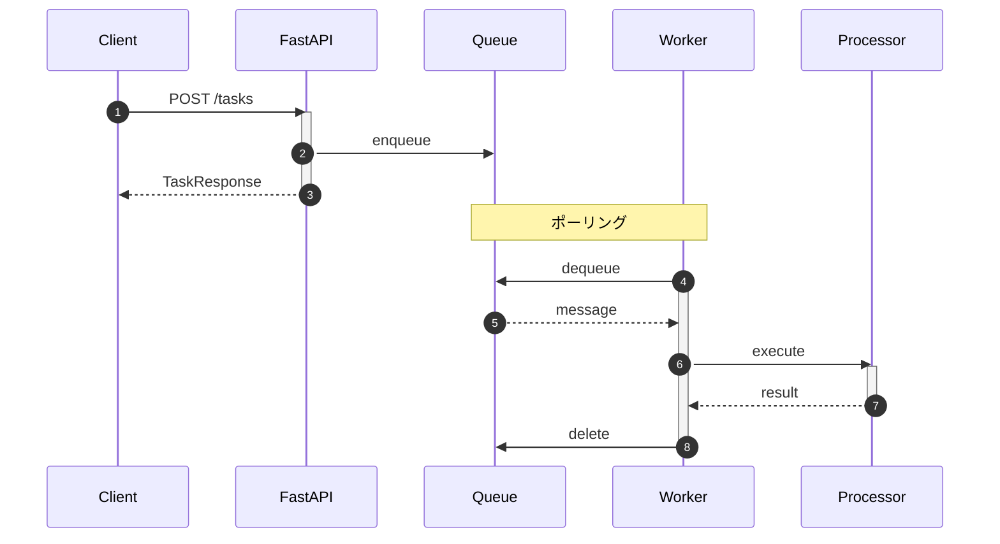

# タスクシステムの完成

**目的**: API と Worker を統合し、E2E 動作を確認する
**対象**: システム全体の動作を理解したい開発者

---

## システム構成

以下の図は、Step 1 で完成したタスクシステムの全体像を示しています。



### コンポーネント一覧

| コンポーネント | ファイル | 役割 |
|--------------|---------|------|
| API | `apps/api/app/main.py` | REST API エンドポイント |
| Worker | `apps/worker/app/worker.py` | キューのポーリング |
| QueueService | `libs/shared/queue_service.py` | Queue 操作 |

---

## E2E 動作確認

### 1. システム起動

```bash
make up
docker compose ps  # 3 コンテナが Up であること
```

### 2. タスク作成

```bash
curl -X POST http://localhost:8000/tasks \
  -H "Content-Type: application/json" \
  -d '{"name": "テストタスク"}'
```

### 3. Worker ログ確認

```bash
make worker-logs
```

期待されるログ:

```
メッセージ処理開始: processor=task, message_id=xxx
タスク処理完了: task-a1b2c3d4
メッセージ処理完了: status=completed
```

---

## 連続実行テスト

複数タスクを投入して並行処理を確認します。

```bash
for i in {1..5}; do
  curl -s -X POST http://localhost:8000/tasks \
    -H "Content-Type: application/json" \
    -d "{\"name\": \"タスク${i}\"}" &
done
wait
```

Worker ログで複数タスクが処理される様子を確認できます。

---

## 現在の制限と次ステップ

Step 1 のシステムには以下の制限があります。

| 制限 | 説明 | 解決章 |
|------|------|--------|
| ステータス更新なし | 処理完了後も pending のまま | Chapter 9 |
| ファイル処理なし | ファイル保存ができない | Chapter 8 |
| エラー処理が簡易 | ポイズンメッセージ対策なし | Chapter 10 |

### なぜ段階的に構築するのか

| 方式 | メリット | デメリット |
|------|---------|-----------|
| **段階的構築** | 各機能を深く理解、デバッグ容易 | 完成まで時間がかかる |
| 一括実装 | 早く完成形が見える | 問題発生時の原因特定が困難 |

> **設計判断**: Step 1 では意図的に機能を絞り、Queue の基本動作（enqueue → dequeue → delete）に集中しました。これにより、メッセージがどう流れるかを確実に理解してから、Part 3 で Blob/Table を追加し、実用的なシステムに拡張します。

---

## トラブルシューティング

| 症状 | 確認項目 |
|------|---------|
| メッセージが処理されない | Worker が起動しているか、キュー名が一致しているか |
| Worker が再起動を繰り返す | `docker compose logs worker` でエラー確認 |
| 接続エラー | Docker 内は `azurite:10001`、ホストは `localhost:10001` |

---

## まとめ

Step 1 完了:

- API → Queue → Worker の E2E 動作
- 複数タスクの並行処理
- ログによる動作確認

---

## 関連ドキュメント

### サンプルコード（GitHub）

- [compose.yaml](https://github.com/sbk0716/azurite-queue-tutorial/blob/main/compose.yaml) - コンテナ定義
- [Makefile](https://github.com/sbk0716/azurite-queue-tutorial/blob/main/Makefile) - 開発コマンド

---

**Part 3: 拡張編**

**Next →** Chapter 8: Blob Storage でファイル管理
