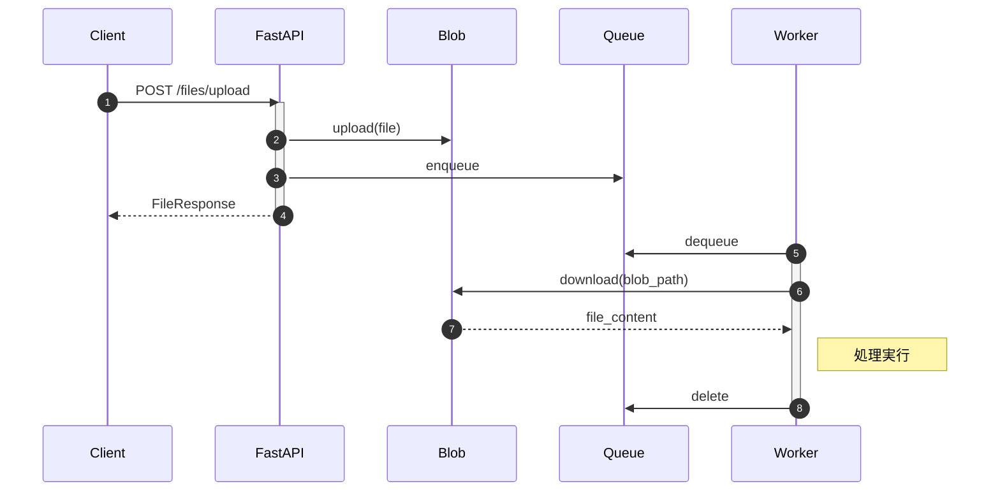

# Blob Storage でファイル管理

**目的**: Blob Storage を追加し、ファイルのアップロードと処理を実装する
**対象**: ファイル管理機能を学びたい開発者

---

## Blob Storage とは

Blob Storage は、大量の非構造化データ（ファイル、画像、動画など）を格納するオブジェクトストレージです。

### 用語

| 用語 | 説明 |
|------|------|
| Storage Account | ストレージの最上位単位 |
| Container | Blob をグループ化する論理単位 |
| Blob | 実際のファイル（Binary Large Object） |

### なぜ Blob Storage を使うのか

| 方式 | メリット | デメリット |
|------|---------|-----------|
| **Blob Storage** | 大容量対応、低コスト、CDN連携可能 | 別サービスへのアクセス必要 |
| Queue に直接含める | シンプル | 64KB 制限、コスト高 |
| データベースに保存 | トランザクション可能 | 大容量に不向き、高コスト |

> **設計判断**: Azure Queue Storage のメッセージサイズ上限は 64KB です。ファイルを直接 Queue に含めると、画像や PDF などの一般的なファイルは送信できません。Blob Storage にファイル実体を保存し、Queue には `file_id` や `blob_path` のみを渡すことで、この制限を回避しつつ疎結合な設計を実現します。

---

## システム構成（Step 2）

以下の図は、Blob Storage を追加したシステム構成を示しています。



---

## BlobService の実装

### 主要メソッド

| メソッド | 役割 |
|---------|------|
| `upload` | ファイルを Blob に保存 |
| `download` | Blob からファイルを取得 |
| `delete` | Blob を削除 |

### コード例

```python
# Azure SDK: Blob Storage 設定クラス
# Content-Type などの HTTP ヘッダーを設定
from azure.storage.blob import ContentSettings
# Azure SDK: Blob Storage 非同期クライアント
# aio モジュールを使用することで async/await が利用可能
from azure.storage.blob.aio import BlobServiceClient, ContainerClient


class BlobService:
    """
    Blob Storage 操作サービス

    ファイルのアップロード・ダウンロードを提供します。

    使用例:
        service = BlobService()
        try:
            await service.upload("path/to/file.txt", content, "text/plain")
        finally:
            await service.close()
    """

    async def upload(
        self,
        blob_name: str,
        data: bytes,
        content_type: Optional[str] = None,
    ) -> str:
        """
        ファイルをアップロード

        Args:
            blob_name: Blob 名（ファイルパス）
                      例: "uploads/file-123/document.pdf"
            data: ファイルデータ（バイト列）
            content_type: Content-Type（MIME タイプ）
                         例: "text/plain", "image/png"

        Returns:
            str: Blob URL
        """
        # コンテナクライアントを取得（自動作成）
        container_client = await self._get_container_client()
        # Blob 名を指定してクライアントを取得
        blob_client = container_client.get_blob_client(blob_name)

        # ============================================================
        # ファイルのアップロード
        # ============================================================
        await blob_client.upload_blob(
            data,
            # 既存の Blob を上書き
            overwrite=True,
            # Content-Type が指定されている場合は ContentSettings を設定
            # ContentSettings は辞書ではなくクラスを使用（重要）
            content_settings=ContentSettings(content_type=content_type)
            if content_type
            else None,
        )

        # Blob URL を返却
        return blob_client.url
```

> **注意**: `ContentSettings` は `azure.storage.blob` からインポートします。辞書ではなくクラスを使用しないとエラーが発生します。

詳細は [blob_service.py](https://github.com/sbk0716/azurite-queue-tutorial/blob/main/libs/shared/blob_service.py) を参照してください。

---

## ファイルアップロード API

### エンドポイント

| メソッド | パス | 説明 |
|---------|------|------|
| POST | `/files/upload` | ファイルアップロード |
| GET | `/files/{file_id}` | ファイル情報取得 |

### 処理フロー

1. ファイル ID 生成
2. Blob Storage にアップロード
3. Queue にメッセージ投入
4. FileResponse を返却

```python
# FastAPI: ルーター機能、ファイルアップロード
from fastapi import APIRouter, UploadFile, File
# 標準ライブラリ: UUID生成用モジュール
import uuid


# APIルーターを作成
# - prefix: すべてのエンドポイントに /files プレフィックスを付与
# - tags: Swagger UIでのグループ化に使用
router = APIRouter(prefix="/files", tags=["Files"])


@router.post("/upload", response_model=FileResponse, status_code=201)
async def upload_file(file: UploadFile = File(...)) -> FileResponse:
    """
    ファイルをアップロード

    3 つの Azure Storage サービスを連携させてファイルを処理:
    1. Blob Storage: ファイル実体を保存
    2. Table Storage: メタデータを登録（status=pending）
    3. Queue Storage: 処理メッセージを投入
    """
    # ファイルIDを生成（UUIDの先頭8文字を使用）
    # 例: "file-a1b2c3d4"
    file_id = f"file-{uuid.uuid4().hex[:8]}"

    # アップロードされたファイルの内容を読み込む
    # 注意: 大きなファイルの場合はストリーミング処理を検討
    content = await file.read()

    # Blob Storage 内のファイルパスを構築
    # 形式: "uploads/{file_id}/{filename}"
    blob_path = f"uploads/{file_id}/{file.filename}"

    # ============================================================
    # 1. Blob Storage にファイル実体をアップロード
    # ============================================================
    blob_service = BlobService()
    try:
        await blob_service.upload(
            # Blob 名（ファイルパス）
            blob_name=blob_path,
            # ファイルのバイナリデータ
            data=content,
            # Content-Type（ダウンロード時に使用）
            content_type=file.content_type,
        )
    finally:
        # 必ずクライアントをクローズしてリソースを解放
        await blob_service.close()

    # ============================================================
    # 2. Queue Storage にメッセージを投入
    # ============================================================
    queue_service = QueueService()
    try:
        # Worker が処理するメッセージを構築
        message = {
            "file_id": file_id,
            "filename": file.filename,
            "blob_path": blob_path,
            # processor_type で Worker がどのプロセッサーを使うか判断
            "processor_type": "file",
        }
        # "task-queue" キューにメッセージを投入
        await queue_service.enqueue("task-queue", message)
    finally:
        # 必ずクライアントをクローズ
        await queue_service.close()

    # ファイル情報をレスポンスとして返却
    return FileResponse(...)
```

---

## ファイルプロセッサー

Worker で Blob からファイルを取得して処理します。

```python
class FileProcessor(BaseProcessor):
    """
    ファイルプロセッサー

    1. Blob Storage からファイルをダウンロード
    2. ファイルを処理（タイプ検出など）
    3. Table Storage のステータスを更新（completed）

    ステータス遷移:
    pending → processing → completed/failed
    """

    @property
    def processor_type(self) -> str:
        """
        プロセッサータイプを返す

        Returns:
            str: "file" - メッセージの processor_type が "file" の場合に選択
        """
        return "file"

    async def execute(self, data: dict[str, Any]) -> dict[str, Any]:
        """
        ファイルを処理

        Args:
            data: メッセージデータ（キューから取得した JSON データ）
                - file_id: ファイルID
                - filename: ファイル名
                - blob_path: Blob パス（uploads/{file_id}/{filename}）

        Returns:
            dict: 処理結果
        """
        # ============================================================
        # メッセージからファイル情報を抽出
        # ============================================================
        # get() を使用してキーが存在しない場合のデフォルト値を設定
        file_id = data.get("file_id", "unknown")
        filename = data.get("filename", "unknown")
        blob_path = data.get("blob_path", "")

        # ============================================================
        # Blob Storage からファイルをダウンロード
        # ============================================================
        # API がアップロードしたファイルを取得
        blob_service = BlobService()
        try:
            # blob_path は "uploads/{file_id}/{filename}" 形式
            file_content = await blob_service.download(blob_path)
            logger.info(
                f"ファイルダウンロード完了: {blob_path}, size={len(file_content)} bytes"
            )
        finally:
            # 必ずクライアントをクローズしてリソースを解放
            await blob_service.close()

        # ============================================================
        # ファイルタイプを検出（マジックナンバーで判定）
        # ============================================================
        file_type = self._detect_file_type(file_content)

        return {
            "status": "completed",
            "file_id": file_id,
            "file_type": file_type,
        }

    def _detect_file_type(self, content: bytes) -> str:
        """
        ファイルタイプを検出（簡易実装）

        ファイルの先頭バイト（マジックナンバー）を確認して判定。
        実際のアプリでは python-magic などのライブラリを推奨。
        """
        # PDF: %PDF で始まる
        if content.startswith(b"%PDF"):
            return "PDF"
        # PNG: \x89PNG で始まる
        elif content.startswith(b"\x89PNG"):
            return "PNG"
        # JPEG: \xff\xd8\xff で始まる
        elif content.startswith(b"\xff\xd8\xff"):
            return "JPEG"
        # ZIP/Office: PK で始まる（.docx, .xlsx も ZIP 形式）
        elif content.startswith(b"PK"):
            return "ZIP/Office"
        # 上記以外: 不明なファイルタイプ
        else:
            return "Unknown"
```

### ファイルタイプ検出

マジックナンバーによる簡易判定を実装しています。

| マジックナンバー | ファイルタイプ |
|-----------------|---------------|
| `%PDF` | PDF |
| `\x89PNG` | PNG |
| `\xff\xd8\xff` | JPEG |
| `PK` | ZIP/Office |

---

## 動作確認

### ファイルアップロード

```bash
echo "Hello, Blob Storage!" > test.txt
curl -X POST http://localhost:8000/files/upload -F "file=@test.txt"
```

### 期待される Worker ログ

```
ファイル処理開始: file-xxx - test.txt
ファイルダウンロード完了: size=21 bytes
ファイル処理完了: file_type=Unknown
```

---

## まとめ

Step 2 完了:

| コンポーネント | 役割 |
|--------------|------|
| BlobService | Blob 操作の抽象化 |
| Files Router | ファイルアップロード API |
| FileProcessor | ファイル処理 |

---

## 関連ドキュメント

### サンプルコード（GitHub）

- [blob_service.py](https://github.com/sbk0716/azurite-queue-tutorial/blob/main/libs/shared/blob_service.py) - BlobService 実装
- [processors/file.py](https://github.com/sbk0716/azurite-queue-tutorial/blob/main/apps/worker/app/processors/file.py) - FileProcessor 実装

### 外部リソース

- [Azure Blob Storage の概要](https://learn.microsoft.com/ja-jp/azure/storage/blobs/storage-blobs-introduction)
- [Azure Storage Explorer](https://azure.microsoft.com/ja-jp/products/storage/storage-explorer/)

---

**Next →** Chapter 9: Table Storage でステータス管理
