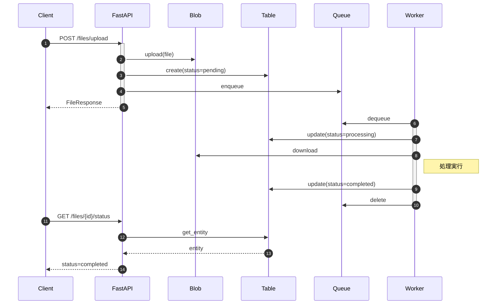
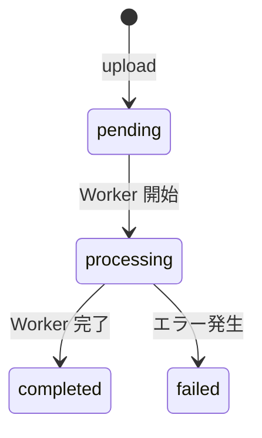

# Table Storage でステータス管理

**目的**: Table Storage を追加し、ファイル処理のステータス管理を実装する
**対象**: NoSQL ストレージとステータス管理を学びたい開発者

---

## Table Storage とは

Table Storage は、構造化データを格納する NoSQL データストアです。

### 用語

| 用語 | 説明 |
|------|------|
| Table | エンティティの集合（RDB のテーブルに相当） |
| Entity | 1 行のデータ |
| PartitionKey | パーティション分割のキー |
| RowKey | パーティション内での一意キー |

> **設計判断**: `PartitionKey` と `RowKey` の組み合わせでエンティティを一意に識別します。同じ PartitionKey を持つエンティティは同じパーティションに格納され、高速にアクセスできます。

---

## システム構成（Step 3 完成形）

以下の図は、3 つの Storage サービスが連携する完成形を示しています。



---

## TableService の実装

### 主要メソッド

| メソッド | 役割 |
|---------|------|
| `create_entity` | エンティティを作成 |
| `get_entity` | エンティティを取得 |
| `update_entity` | エンティティを更新（マージ） |
| `query_entities` | エンティティをクエリ |

### コード例

```python
# Azure SDK: Table Storage 非同期クライアント
from azure.data.tables.aio import TableServiceClient, TableClient
# Azure SDK: 例外クラス（リソースが既に存在する場合）
from azure.core.exceptions import ResourceExistsError
# 標準ライブラリ: 日時操作用モジュール
from datetime import datetime, timezone


class TableService:
    """
    Table Storage 操作サービス

    エンティティの作成・更新・取得・削除を提供します。

    使用例:
        service = TableService()
        try:
            await service.create_entity("pk", "rk", {"Status": "pending"})
        finally:
            await service.close()
    """

    async def create_entity(
        self,
        partition_key: str,
        row_key: str,
        data: dict[str, Any],
    ) -> dict[str, Any]:
        """
        エンティティを作成

        Args:
            partition_key: パーティションキー
                          同じキーのエンティティは同じパーティションに配置
            row_key: 行キー（パーティション内での一意識別子）
            data: エンティティデータ（任意のプロパティを含む辞書）

        Returns:
            dict: 作成されたエンティティ
        """
        table_client = await self._get_table_client()

        # ============================================================
        # エンティティの構築
        # ============================================================
        # 現在時刻を UTC ISO 8601 形式で取得
        now = datetime.now(timezone.utc).isoformat()

        entity = {
            # 必須キー
            "PartitionKey": partition_key,
            "RowKey": row_key,
            # 自動生成フィールド
            "CreatedAt": now,
            "UpdatedAt": now,
            # ユーザー指定データをマージ
            **data,
        }

        # エンティティを作成
        await table_client.create_entity(entity)

        return entity

    async def update_entity(
        self,
        partition_key: str,
        row_key: str,
        data: dict[str, Any],
    ) -> dict[str, Any]:
        """
        エンティティを更新（マージ）

        マージモードのため、指定したプロパティのみが更新されます。
        UpdatedAt は自動的に更新されます。

        Args:
            partition_key: パーティションキー
            row_key: 行キー
            data: 更新データ（更新したいプロパティのみ）
        """
        table_client = await self._get_table_client()

        # ============================================================
        # 更新エンティティの構築
        # ============================================================
        entity = {
            # 必須キー（識別用）
            "PartitionKey": partition_key,
            "RowKey": row_key,
            # 更新日時を自動設定
            "UpdatedAt": datetime.now(timezone.utc).isoformat(),
            # ユーザー指定データをマージ
            **data,
        }

        # マージモードで更新
        # mode="merge": 指定したプロパティのみ更新
        # mode="replace": エンティティ全体を置換
        await table_client.update_entity(entity, mode="merge")

        return entity

    async def get_entity(
        self,
        partition_key: str,
        row_key: str,
    ) -> Optional[dict[str, Any]]:
        """
        エンティティを取得

        PartitionKey と RowKey を指定してエンティティを取得します。
        これはポイントクエリで、最も高速なアクセス方法です。

        Returns:
            dict: エンティティ（存在しない場合は None）
        """
        table_client = await self._get_table_client()

        try:
            # ポイントクエリでエンティティを取得
            entity = await table_client.get_entity(partition_key, row_key)
            # Azure SDK のエンティティを Python 辞書に変換
            return dict(entity)
        except Exception as e:
            # エンティティが存在しない場合は None を返す
            if "ResourceNotFound" in str(e):
                return None
            raise

    async def query_entities(
        self,
        filter_query: Optional[str] = None,
    ) -> list[dict[str, Any]]:
        """
        エンティティを条件検索

        OData フィルタ式を使用してエンティティを検索します。
        フィルタなしの場合は全エンティティを返します。

        Args:
            filter_query: OData フィルタ式
                         例: "PartitionKey eq 'files'"
                         例: "Status eq 'pending'"

        Returns:
            list[dict]: マッチしたエンティティのリスト
        """
        table_client = await self._get_table_client()

        entities = []
        # OData フィルタを使用してクエリ
        # filter_query が None の場合は全エンティティを取得
        async for entity in table_client.query_entities(filter_query):
            # Azure SDK のエンティティを Python 辞書に変換
            entities.append(dict(entity))

        return entities
```

詳細は [table_service.py](https://github.com/sbk0716/azurite-queue-tutorial/blob/main/libs/shared/table_service.py) を参照してください。

---

## ステータス管理

### ステータス遷移

以下の図は、ファイル処理のステータス遷移を示しています。



| ステータス | 説明 | 更新タイミング |
|-----------|------|---------------|
| pending | 処理待ち | API でアップロード時 |
| processing | 処理中 | Worker 処理開始時 |
| completed | 処理完了 | Worker 処理完了時 |
| failed | 処理失敗 | エラー発生時 |

---

## API エンドポイント

| メソッド | パス | 説明 |
|---------|------|------|
| POST | `/files/upload` | ファイルアップロード |
| GET | `/files` | ファイル一覧取得 |
| GET | `/files/{file_id}/status` | ステータス確認 |

### ファイルアップロード

1. Blob Storage にファイル保存
2. Table Storage にメタデータ登録（status=pending）
3. Queue にメッセージ投入

```python
# Table Storage のパーティションキー
# すべてのファイルエンティティを同じパーティションに配置
DEFAULT_PARTITION_KEY = "files"


@router.post("/upload", response_model=FileResponse, status_code=201)
async def upload_file(file: UploadFile = File(...)) -> FileResponse:
    """
    ファイルをアップロード

    3 つの Azure Storage サービスを連携させてファイルを処理:
    1. Blob Storage: ファイル実体を保存
    2. Table Storage: メタデータを登録（status=pending）
    3. Queue Storage: 処理メッセージを投入
    """
    # ============================================================
    # 1. Blob Storage にファイル実体をアップロード
    # ============================================================
    blob_service = BlobService()
    try:
        await blob_service.upload(blob_path, content, file.content_type)
    finally:
        await blob_service.close()

    # ============================================================
    # 2. Table Storage にメタデータを登録
    # ============================================================
    table_service = TableService()
    try:
        await table_service.create_entity(
            # パーティションキー（同じパーティション内のデータは高速にアクセス可能）
            partition_key=DEFAULT_PARTITION_KEY,
            # 行キー（パーティション内での一意識別子）
            row_key=file_id,
            # 追加のエンティティプロパティ
            data={
                "Filename": file.filename,
                "ContentType": file.content_type or "",
                "Size": len(content),
                "Status": "pending",
                "BlobPath": blob_path,
            },
        )
    finally:
        await table_service.close()

    # ============================================================
    # 3. Queue Storage にメッセージを投入
    # ============================================================
    queue_service = QueueService()
    try:
        await queue_service.enqueue("task-queue", message)
    finally:
        await queue_service.close()

    return FileResponse(...)
```

### ファイル一覧取得

```python
@router.get("", response_model=list[FileResponse])
async def list_files() -> list[FileResponse]:
    """
    ファイル一覧を取得

    Table Storage から全ファイルのメタデータを取得します。
    query_entities メソッドを使用して OData フィルタでクエリします。
    """
    table_service = TableService()
    try:
        # パーティションキーでフィルタリング
        # 同じパーティション内の全エンティティを取得
        entities = await table_service.query_entities(
            filter_query=f"PartitionKey eq '{DEFAULT_PARTITION_KEY}'"
        )

        # エンティティを FileResponse に変換して返却
        return [
            FileResponse(
                file_id=entity["RowKey"],
                filename=entity.get("Filename", ""),
                status=entity.get("Status", "unknown"),
                created_at=entity.get("CreatedAt", ""),
            )
            for entity in entities
        ]
    finally:
        await table_service.close()
```

### ステータス確認

```python
@router.get("/{file_id}/status")
async def get_file_status(file_id: str) -> dict:
    """
    ファイル処理ステータスを取得（Table Storage から）

    Worker による処理の進捗状況を確認するためのエンドポイント。
    ポーリングによるステータス確認に使用する。
    """
    table_service = TableService()
    try:
        # Table Storage からエンティティを取得
        entity = await table_service.get_entity(
            partition_key=DEFAULT_PARTITION_KEY,
            row_key=file_id,
        )
    finally:
        # 必ずクライアントをクローズ
        await table_service.close()

    # エンティティが見つからない場合は 404 エラー
    if entity is None:
        raise HTTPException(status_code=404, detail="File not found")

    # ステータス情報のみを返却
    return {
        "file_id": file_id,
        "status": entity.get("Status", "unknown"),
        "updated_at": entity.get("UpdatedAt", ""),
    }
```

---

## Worker のステータス更新

Worker は処理の各段階でステータスを更新します。

```python
# Table Storage のパーティションキー
# API 側（files.py）と同じ値を使用する必要がある
DEFAULT_PARTITION_KEY = "files"


class FileProcessor(BaseProcessor):
    """
    ファイルプロセッサー

    ステータス遷移:
    pending → processing → completed/failed
    """

    async def execute(self, data: dict[str, Any]) -> dict[str, Any]:
        """
        ファイルを処理

        3 つの Storage サービスを連携させてファイル処理を行います:
        1. Table: ステータスを processing に更新
        2. Blob: ファイルをダウンロード
        3. 処理: ファイルタイプ検出
        4. Table: ステータスを completed に更新
        """
        # メッセージからファイル情報を抽出
        file_id = data.get("file_id", "unknown")
        blob_path = data.get("blob_path", "")

        # ============================================================
        # 1. Table Storage のステータスを processing に更新
        # ============================================================
        # クライアントがステータスをポーリングした際に
        # 「処理中」であることを確認できるようにする
        table_service = TableService()
        try:
            await table_service.update_entity(
                # パーティションキー: API 側と同じ値
                partition_key=DEFAULT_PARTITION_KEY,
                # 行キー: ファイルIDで特定
                row_key=file_id,
                # 更新データ: Status を processing に変更
                data={"Status": "processing"},
            )
        finally:
            await table_service.close()

        # ============================================================
        # 2. Blob Storage からファイルをダウンロード
        # ============================================================
        blob_service = BlobService()
        try:
            file_content = await blob_service.download(blob_path)
        finally:
            await blob_service.close()

        # ============================================================
        # 3. ファイル処理（例: タイプ検出）
        # ============================================================
        file_type = self._detect_file_type(file_content)

        # ============================================================
        # 4. Table Storage のステータスを completed に更新
        # ============================================================
        # 処理結果も一緒に保存（クライアントが確認可能）
        table_service = TableService()
        try:
            await table_service.update_entity(
                partition_key=DEFAULT_PARTITION_KEY,
                row_key=file_id,
                data={
                    # 処理完了ステータス
                    "Status": "completed",
                    # ファイルタイプ（Table Storage に保存）
                    "FileType": file_type,
                },
            )
        finally:
            await table_service.close()

        return {"status": "completed", "file_id": file_id}
```

---

## 動作確認

### ファイルアップロードとステータス確認

```bash
# アップロード
curl -X POST http://localhost:8000/files/upload -F "file=@test.txt"

# ステータス確認（処理中）
curl http://localhost:8000/files/file-xxx/status
# {"status": "processing"}

# ステータス確認（完了後）
curl http://localhost:8000/files/file-xxx/status
# {"status": "completed"}
```

---

## まとめ

Step 3 完了:

| サービス | 役割 |
|---------|------|
| Queue Storage | 非同期メッセージング |
| Blob Storage | ファイル保存 |
| Table Storage | メタデータ・ステータス管理 |

---

## 関連ドキュメント

### サンプルコード（GitHub）

- [table_service.py](https://github.com/sbk0716/azurite-queue-tutorial/blob/main/libs/shared/table_service.py) - TableService 実装
- [files.py](https://github.com/sbk0716/azurite-queue-tutorial/blob/main/apps/api/app/routers/files.py) - Files Router 実装

### 外部リソース

- [Azure Table Storage の概要](https://learn.microsoft.com/ja-jp/azure/storage/tables/table-storage-overview)
- [Table Storage のベストプラクティス](https://learn.microsoft.com/ja-jp/azure/storage/tables/table-storage-design-guidelines)

---

**Next →** Chapter 10: エラーハンドリングと DLQ
