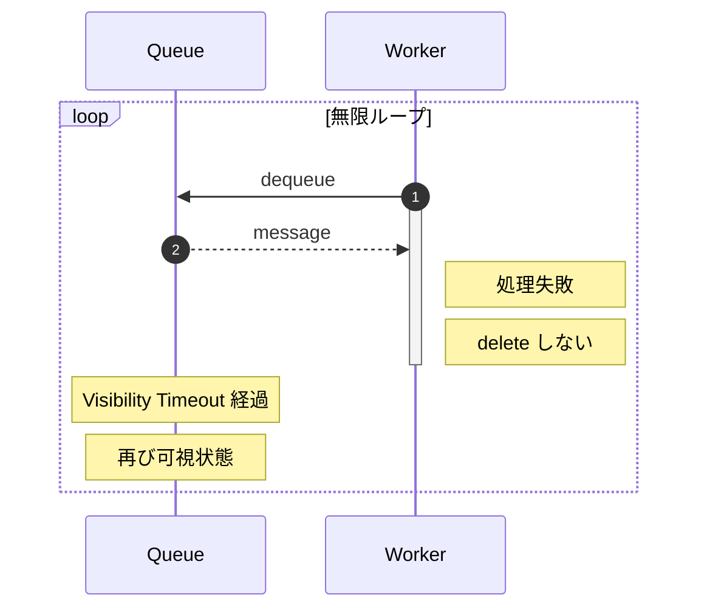
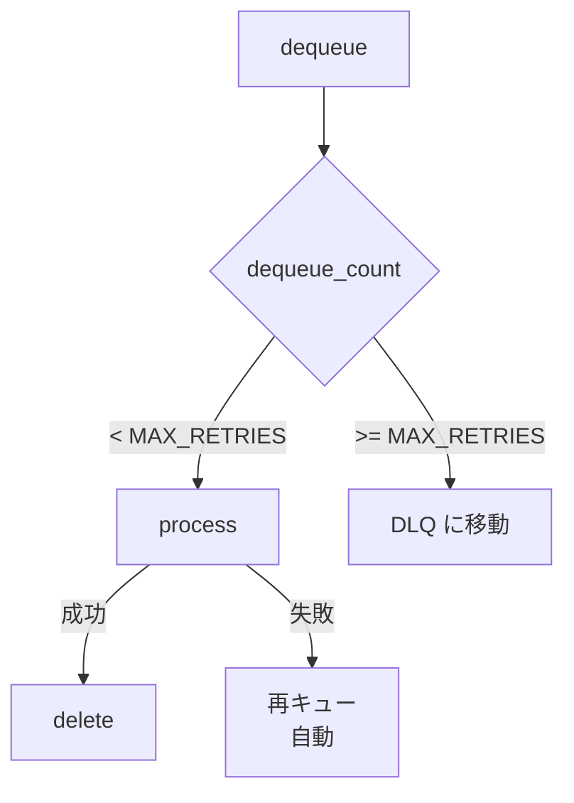
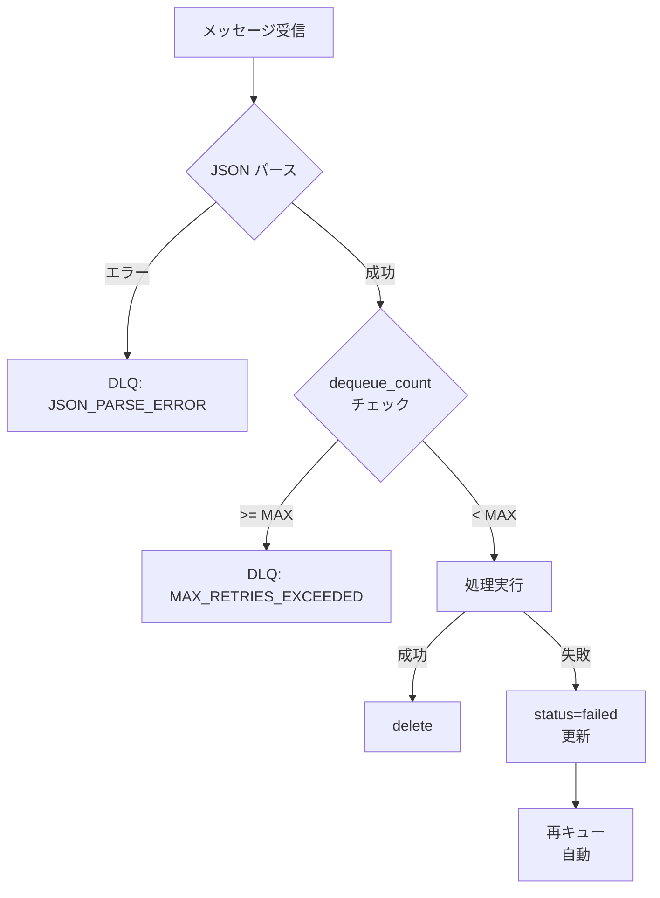

# エラーハンドリングと DLQ

**目的**: ポイズンメッセージへの対策と Dead Letter Queue（DLQ）を実装する
**対象**: 本番運用を見据えたエラー処理を学びたい開発者

---

## ポイズンメッセージとは

何度処理しても失敗するメッセージを「ポイズンメッセージ」と呼びます。

以下の図は、ポイズンメッセージが無限ループを引き起こす問題を示しています。



### ポイズンメッセージの原因

| 原因 | 例 |
|------|-----|
| データ不正 | JSON パースエラー、必須フィールド欠損 |
| 外部依存 | 存在しないファイル、無効な URL |
| バグ | 特定条件でクラッシュするコード |

---

## Dead Letter Queue（DLQ）

DLQ は、処理に失敗したメッセージを隔離するためのキューです。

以下の図は、DLQ への移動フローを示しています。



### なぜ DLQ が必要か

| 方式 | メリット | デメリット |
|------|---------|-----------|
| **DLQ 移動** | 無限ループ防止、後で調査可能 | 実装が必要 |
| 即座に削除 | シンプル | データロスのリスク |
| 放置 | なし | 無限ループ発生 |

> **設計判断**: ポイズンメッセージを DLQ に移動することで、正常なメッセージの処理を継続しつつ、問題のあるメッセージを後で調査・再処理できます。

---

## DLQ 移動の実装

### 処理フロー

```python
async def process_message(
    queue_service: QueueService,
    queue_name: str,
    message: Any,
    max_retries: int,
    dlq_ttl_days: int,
) -> None:
    """
    メッセージを処理

    処理フロー:
    1. リトライ回数チェック → 超過していればDLQへ
    2. JSONパース → 失敗すればDLQへ
    3. プロセッサーで処理 → 成功すればメッセージ削除
    4. 処理失敗 → メッセージを削除しない（自動リトライ）
    """
    try:
        # ============================================================
        # 1. リトライ回数チェック
        # ============================================================
        # dequeue_count が max_retries を超えたらDLQへ移動
        # 例: max_retries=5 の場合、6回目の取得でDLQへ
        if message.dequeue_count > max_retries:
            await move_to_dlq(
                queue_service,
                queue_name,
                message,
                # 理由: 最大リトライ回数超過
                "MAX_RETRIES_EXCEEDED",
                {"last_dequeue_count": message.dequeue_count},
                dlq_ttl_days,
            )
            return

        # ============================================================
        # 2. メッセージ内容のJSONパース
        # ============================================================
        try:
            # メッセージ内容をJSON文字列からPython辞書に変換
            data = json.loads(message.content)
        except json.JSONDecodeError as e:
            # JSONパースエラーの場合はDLQへ
            # これは修正不可能なエラーなので即座にDLQへ
            await move_to_dlq(
                queue_service,
                queue_name,
                message,
                # 理由: JSONパースエラー
                "JSON_PARSE_ERROR",
                {"error": str(e)},
                dlq_ttl_days,
            )
            return

        # ============================================================
        # 3. プロセッサーで処理
        # ============================================================
        processor_type = data.get("processor_type", "task")
        processor = get_processor(processor_type)

        # 処理開始ログ
        logger.info(
            f"メッセージ処理開始: processor={processor_type}, "
            f"message_id={message.id}, dequeue_count={message.dequeue_count}"
        )

        # プロセッサーの execute メソッドを呼び出して処理実行
        result = await processor.execute(data)

        # ============================================================
        # 4. 処理成功 → メッセージ削除
        # ============================================================
        await queue_service.delete_message(queue_name, message)

    except Exception as e:
        # ============================================================
        # 処理失敗 → メッセージを削除しない
        # ============================================================
        # 例外が発生した場合、メッセージを削除しない
        # → Visibility Timeout 経過後に再びキューに現れる（自動リトライ）
        logger.error(
            f"メッセージ処理エラー: message_id={message.id}, "
            f"dequeue_count={message.dequeue_count}, error={str(e)}"
        )
        # メッセージを削除しない → Visibility Timeout後に再キュー
```

### DLQ 移動関数

```python
async def move_to_dlq(
    queue_service: QueueService,
    queue_name: str,
    message: Any,
    reason: str,
    error_context: Optional[dict] = None,
    ttl_days: int = 7,
) -> None:
    """
    ポイズンメッセージをDLQに移動

    何度処理しても失敗するメッセージ（ポイズンメッセージ）を
    専用のDLQキューに退避させる。これにより:
    - 正常なメッセージの処理が継続できる
    - 問題のあるメッセージを後で調査・再処理できる

    Args:
        queue_service: Queue Service インスタンス
        queue_name: 元のキュー名
        message: ポイズンメッセージオブジェクト
        reason: DLQ移動理由（例: "MAX_RETRIES_EXCEEDED"）
        error_context: エラーに関する追加情報
        ttl_days: DLQメッセージの保持期間（日）
    """
    # DLQキュー名を生成（例: "task-queue" → "task-poison-queue"）
    dlq_name = f"{queue_name.replace('-queue', '')}-poison-queue"

    try:
        # DLQに送信するペイロードを構築
        now_utc = datetime.now(timezone.utc)
        dlq_payload = {
            # 元のキュー名（どのキューから来たか追跡用）
            "original_queue": queue_name,
            # 元のメッセージID
            "original_message_id": message.id,
            # 何回取得されたか（リトライ回数 + 1）
            "dequeue_count": message.dequeue_count,
            # DLQに移動した日時
            "moved_at": now_utc.isoformat(),
            # 移動理由
            "reason": reason,
            # エラーの詳細情報
            "error_context": error_context or {},
            # 元のメッセージ内容
            "original_content": json.loads(message.content),
        }

        # TTL（Time To Live）を秒単位に変換
        ttl_seconds = ttl_days * 24 * 60 * 60
        # DLQにメッセージを送信
        await queue_service.enqueue(dlq_name, dlq_payload, ttl=ttl_seconds)

        # 元のキューからメッセージを削除
        # これをしないとVisibility Timeout後に再度キューに現れる
        await queue_service.delete_message(queue_name, message)

        # 警告ログを出力（DLQ移動は注意が必要なイベント）
        logger.warning(
            f"DLQ移動: {queue_name} -> {dlq_name}, "
            f"reason={reason}, dequeue_count={message.dequeue_count}"
        )

    except Exception as e:
        # DLQ移動自体が失敗した場合はエラーログを出力
        logger.error(f"DLQ移動エラー: {e}")
        raise
```

---

## DLQ ペイロードの構造

DLQ に移動されたメッセージには、調査に必要な情報が含まれます。

```json
{
  "original_queue": "task-queue",
  "original_message_id": "abc123",
  "dequeue_count": 6,
  "moved_at": "2026-01-17T10:30:00+00:00",
  "reason": "MAX_RETRIES_EXCEEDED",
  "error_context": {"last_dequeue_count": 6},
  "original_content": {"file_id": "file-xxx", "processor_type": "file"}
}
```

| フィールド | 説明 |
|-----------|------|
| original_queue | 元のキュー名 |
| original_message_id | 元のメッセージID |
| dequeue_count | 取得回数（リトライ回数 + 1） |
| moved_at | DLQ に移動した日時（ISO 8601） |
| reason | 移動理由 |
| error_context | エラーの詳細情報 |
| original_content | 元のメッセージ内容 |

---

## エラー時のステータス更新

FileProcessor でエラー時にステータスを `failed` に更新します。

```python
# Table Storage のパーティションキー
DEFAULT_PARTITION_KEY = "files"


async def execute(self, data: dict[str, Any]) -> dict[str, Any]:
    """
    ファイルを処理

    エラー発生時は Table Storage のステータスを failed に更新し、
    例外を再スローして自動リトライを有効にする。
    """
    # メッセージからファイル情報を抽出
    file_id = data.get("file_id", "unknown")
    blob_path = data.get("blob_path", "")

    try:
        # ============================================================
        # 1. ステータスを processing に更新
        # ============================================================
        table_service = TableService()
        try:
            await table_service.update_entity(
                partition_key=DEFAULT_PARTITION_KEY,
                row_key=file_id,
                data={"Status": "processing"},
            )
        finally:
            await table_service.close()

        # ============================================================
        # 2. Blob からダウンロードして処理
        # ============================================================
        blob_service = BlobService()
        try:
            file_content = await blob_service.download(blob_path)
        finally:
            await blob_service.close()

        # ... ファイル処理 ...

        # ============================================================
        # 3. ステータスを completed に更新
        # ============================================================
        table_service = TableService()
        try:
            await table_service.update_entity(
                partition_key=DEFAULT_PARTITION_KEY,
                row_key=file_id,
                data={"Status": "completed"},
            )
        finally:
            await table_service.close()

        return {"status": "completed", "file_id": file_id}

    except Exception as e:
        # ============================================================
        # エラー時は failed に更新
        # ============================================================
        table_service = TableService()
        try:
            await table_service.update_entity(
                partition_key=DEFAULT_PARTITION_KEY,
                row_key=file_id,
                data={
                    # 処理失敗ステータス
                    "Status": "failed",
                    # エラーメッセージ（調査用）
                    "ErrorMessage": str(e),
                },
            )
        finally:
            await table_service.close()

        # 例外を再スロー → Worker がメッセージを削除しない
        # → Visibility Timeout 後に自動リトライ
        raise
```

---

## リトライ設定

### config/queues.yaml

```yaml
queues:
  - name: task-queue
    max_retries: 5        # 最大リトライ回数
    dlq_ttl_days: 7       # DLQ メッセージの保持期間
```

### リトライのタイムライン

```
dequeue 1 → 処理失敗 → 30秒後（Visibility Timeout）
              ↓
dequeue 2 → 処理失敗 → 30秒後
              ...
dequeue 6 → MAX_RETRIES 超過 → DLQ 移動
```

---

## エラーハンドリングのフロー

以下の図は、エラーハンドリング全体のフローを示しています。



---

## DLQ の運用

### DLQ メッセージの確認

```python
# Azure SDK: Queue Storage 非同期クライアント
from azure.storage.queue.aio import QueueServiceClient


async def check_dlq():
    """
    DLQ のメッセージを確認

    peek_messages はメッセージを「覗き見」するだけで、
    dequeue_count は増加しない。
    """
    # 接続文字列からクライアントを生成
    client = QueueServiceClient.from_connection_string(conn_str)

    try:
        # DLQ のキュークライアントを取得
        queue = client.get_queue_client("task-poison-queue")

        # メッセージを最大10件取得（削除されない）
        messages = await queue.peek_messages(max_messages=10)

        # 各メッセージの情報を表示
        for msg in messages:
            # JSON をパースして内容を取得
            content = json.loads(msg.content)
            # 移動理由を表示
            print(f"Reason: {content['reason']}")
            # エラーの詳細情報を表示
            print(f"Error Context: {content['error_context']}")
            # 元のメッセージ内容を表示
            print(f"Original: {content['original_content']}")
    finally:
        await client.close()
```

### DLQ メッセージの再処理

1. 原因を調査・修正
2. メッセージを元のキューに戻す
3. または手動で処理

---

## まとめ

| 機能 | 説明 |
|------|------|
| DLQ 移動 | 最大リトライ超過時に隔離 |
| エラー理由の記録 | 調査に必要な情報を保存 |
| ステータス更新 | エラー時に `failed` に更新 |
| リトライ制御 | 設定ファイルで回数を管理 |

---

## 関連ドキュメント

### サンプルコード（GitHub）

- [worker.py](https://github.com/sbk0716/azurite-queue-tutorial/blob/main/apps/worker/app/worker.py) - Worker 実装
- [queues.yaml](https://github.com/sbk0716/azurite-queue-tutorial/blob/main/config/queues.yaml) - リトライ設定

### 外部リソース

- [Dead Letter Queue パターン](https://learn.microsoft.com/ja-jp/azure/architecture/patterns/queue-based-load-leveling)
- [リトライパターン](https://learn.microsoft.com/ja-jp/azure/architecture/patterns/retry)

---

**Next →** Chapter 11: おわりに
