# おわりに

**目的**: 本書の総まとめと本番 Azure への移行ガイドを提供する
**対象**: 本番運用を検討している開発者

---

## 本書で学んだこと

### 概要

| Part   | Chapter | 内容                             |
| ------ | ------- | -------------------------------- |
| 基礎編 | 1-4     | 環境構築、Queue Storage の基礎   |
| 実装編 | 5-7     | API・Worker の実装、E2E 動作確認 |
| 拡張編 | 8-9     | Blob・Table Storage の統合       |
| 応用編 | 10-11   | エラーハンドリング、本番移行     |

### 完成したシステム

以下の図は、完成したシステムの全体像を示しています。

```mermaid
flowchart TB
    subgraph Client
        U[ユーザー]
    end

    subgraph API["FastAPI"]
        EP["/files/upload"]
    end

    subgraph Storage["Azure Storage"]
        B[(Blob)]
        Q[(Queue)]
        T[(Table)]
        DLQ[(Poison Queue)]
    end

    subgraph Worker["Worker"]
        P[Processor]
    end

    U -->|①POST| EP
    EP -->|②ファイル保存| B
    EP -->|③メタデータ登録| T
    EP -->|④メッセージ投入| Q
    Q -->|⑤ポーリング| P
    P -->|⑥ファイル取得| B
    P -->|⑦ステータス更新| T
    P -.->|⑧エラー時| DLQ
```



### 処理フローの詳細

| ステップ | 処理内容       | 説明                                            |
| -------- | -------------- | ----------------------------------------------- |
| ①        | POST           | ユーザーがファイルをアップロード                |
| ②        | ファイル保存   | Blob Storage にファイル実体を保存               |
| ③        | メタデータ登録 | Table Storage に初期ステータス（pending）を登録 |
| ④        | メッセージ投入 | Queue にファイル処理リクエストを投入            |
| ⑤        | ポーリング     | Worker が Queue からメッセージを取得            |
| ⑥        | ファイル取得   | Worker が Blob からファイルを取得して処理       |
| ⑦        | ステータス更新 | Table Storage のステータスを completed に更新   |
| ⑧        | エラー時       | 処理失敗時は Poison Queue（DLQ）に移動          |

---

## 本番 Azure への移行

### 1. 接続文字列の変更

| 環境    | エンドポイント                             |
| ------- | ------------------------------------------ |
| Azurite | `http://azurite:10001/devstoreaccount1`    |
| Azure   | `https://<account>.queue.core.windows.net` |

接続文字列は Azure Portal の Storage Account → Access Keys から取得できます。

### 2. Managed Identity の使用（推奨）

本番環境では、接続文字列よりも Managed Identity を推奨します。

| 方式                 | シークレット管理 | ローテーション |
| -------------------- | ---------------- | -------------- |
| 接続文字列           | 必要             | 手動           |
| **Managed Identity** | 不要             | 自動           |

```python
from azure.identity.aio import DefaultAzureCredential

credential = DefaultAzureCredential()
client = QueueServiceClient(account_url="https://...", credential=credential)
```

---

## 発展的なトピック

本番運用では以下のトピックも検討してください。

### 監視とスケーリング

| カテゴリ     | サービス/戦略                       |
| ------------ | ----------------------------------- |
| 監視         | Azure Monitor, Application Insights |
| スケーリング | Worker インスタンスの水平スケール   |
| 自動スケール | キュー長に応じた自動調整            |

### セキュリティ

| 対策             | 説明                             |
| ---------------- | -------------------------------- |
| VNET 統合        | プライベートネットワーク内で通信 |
| Private Endpoint | パブリックアクセスを無効化       |
| RBAC             | 最小権限の原則                   |

---

## FAQ

### Azurite と Azure Storage の違い

| 項目   | Azurite              | Azure Storage |
| ------ | -------------------- | ------------- |
| 用途   | ローカル開発・テスト | 本番運用      |
| コスト | 無料                 | 従量課金      |
| SLA    | なし                 | 99.9%+        |

### 本番で使う前に強化すべき点

- エラーハンドリングの強化
- ログ出力の構造化（JSON 形式など）
- 監視・アラートの設定
- セキュリティ設定（RBAC、VNET）

---

## まとめ

本書で構築したシステムは、3 つの Azure Storage サービスを組み合わせたものです。

| サービス      | 役割                       |
| ------------- | -------------------------- |
| Queue Storage | 非同期メッセージング       |
| Blob Storage  | ファイル保存               |
| Table Storage | メタデータ・ステータス管理 |

これらのサービスを理解し、適切に組み合わせることで、堅牢で拡張性の高いシステムを構築できます。

---

## 関連ドキュメント

### 外部リソース

- [Azure Storage ドキュメント](https://learn.microsoft.com/ja-jp/azure/storage/)
- [Azurite GitHub](https://github.com/Azure/Azurite)
- [azure-storage-queue (Python)](https://pypi.org/project/azure-storage-queue/)
- [FastAPI ドキュメント](https://fastapi.tiangolo.com/)
- [Azure Managed Identity](https://learn.microsoft.com/ja-jp/azure/active-directory/managed-identities-azure-resources/)

---

本書が、皆様のクラウドネイティブ開発の第一歩となれば幸いです。
